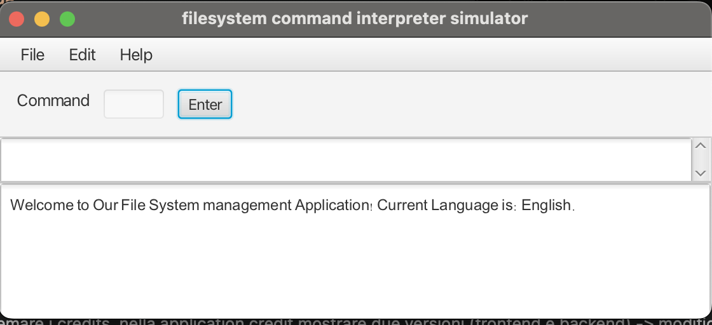
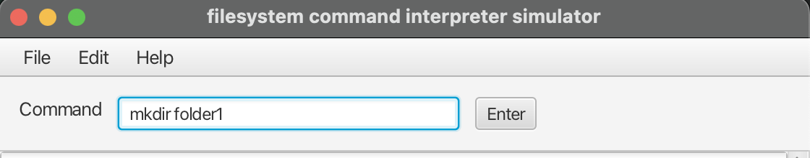
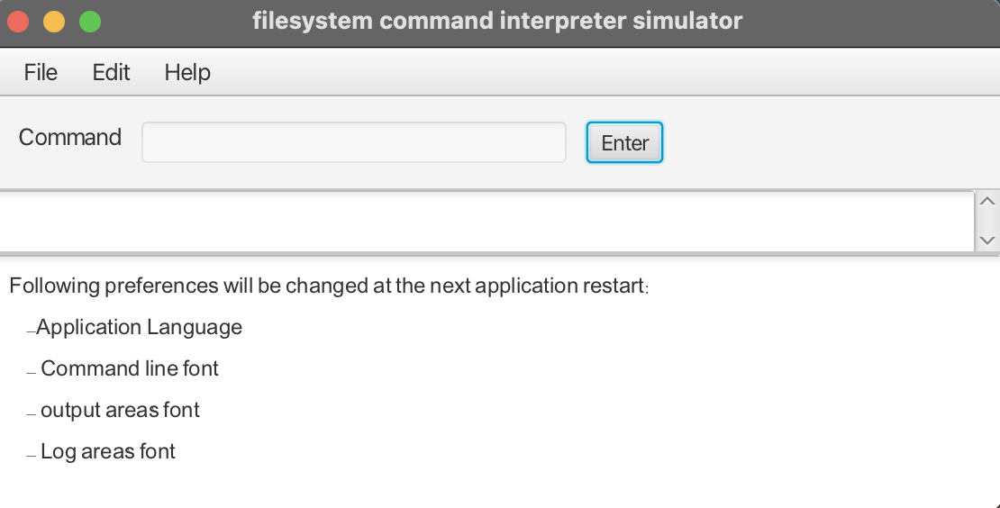

# File System Command Line Interface - FSCLI

FSCLI is a Java application developed as part of the Software Engineering Laboratory at SUPSI.
The project simulates the management of a file system through a command-line interface supported by a graphical user interface built with JavaFX.

This README provides an overview of the project, its architecture, and instructions to run it.

## Description
FSCLI (File System Command Line Interface) is a desktop application that allows users to interact with a virtual file system using a command-line interface integrated into a graphical environment.
The project focuses on:
* clean layered architecture
* separation of concerns
* use of design patterns such as MVC and Observer
* persistent user preferences
* internationalization (i18n)
* The application does not interact with the real operating system file system; instead, it manages an abstract and controlled file system model.


## Badges
The project includes:
* automated build through GitLab CI
* unit, integration, and GUI tests
* test coverage measurement

## Visuals
Here are some images of the FSCLI application in action:
### Main interface

* Through file menu, you can operate on the virtual filesystem, creating, opening or saving it.
* Through prefereneces menu, you can change application settings like language, font or dimensions.
* Through help menu, you can access documentation or about dialog.

### Command execution

* The command line allows you to enter commands to interact with the virtual file system.
* The output area displays the results of executed commands and any error messages.

### Preferences changes and main operation on application

* As said before, preferences menu is used to change application settings. Also operations on the application
  (like creating a new virtual filesystem) can be done through file menu.
* This operations's feedback will be available in log area.
## Installation
To run FSCLI on your system, follow these steps:

### Requirements
- Java 17 or higher
- Maven 3.8 or higher
- Git (for cloning the repository)

### Steps
1. Clone the repository:
```bash
git clone https://gitlab-edu.supsi.ch/dti-isin/labingsw/labingsw02/2025-2026/fscli/Gruppo_17.git
cd Gruppo_17/frontend
```
2. Build the project using Maven:
```bash
mvn clean package
```
this will generate the executable JAR file with all dependencies in frontend's target folder.
3. Run the application:
```bash
java -jar frontend/target/fscli-jar-with-dependencies.jar
```


## Usage

Once FSCLI is built, you can run it using the following command:

```bash
java -jar frontend/target/fscli-jar-with-dependencies.jar
```
The application opens a graphical interface with an integrated command-line. Here some example commands you can use:
- `ls`: List files and directories in the current directory.
- `cd <directory>`: Change the current directory to `<directory>`.
- `mkdir <directory>`: Create a new directory named `<directory>`.
- `touch <file>`: Create a new empty file named `<file>`.
- `rm <file/directory>`: Remove the specified file or directory.
- `help`: Display a list of available commands.

The application keeps track of your commands in output area and preferences are persisted between session.

Internationalization (i18n) is supported, so you can change the language via preferences.

## Support
For help and questions developers are available via email. You just need to write to surname.name@student.supsi.ch changing "surname" and "name" with the respective author's data.

## Roadmap
Future improvements and planned features for FSCLI include:

- Add support for additional file system commands (e.g., advanced search, batch operations)
- Enhance the GUI with more interactive elements and better user experience
- Implement more comprehensive internationalization support for multiple languages
- Integrate more robust error handling and logging
- Expand test coverage, including end-to-end tests
- Explore deployment as a standalone executable with platform-specific installers


## Contributing
We welcome contributions to the FSCLI project! If you would like to contribute, please follow these steps:

1. **Fork the repository** and create a feature branch from 'dev' for your changes.

2. **Set up the development environment**:
    * Ensure you have Java 17 or higher installed.
    * Make sure Maven is installed to build the project.
    * Clone the repository.
    * Build the project and resolve all dependencies with Maven:
      ```
      mvn clean package
      ```

3. **Running the application**:
    * The application can be started with:
      ```
      java -jar frontend/target/fscli-jar-with-dependencies.jar
      ```

4. **Running tests**:
    * Unit tests are implemented with JUnit, Mockito, and JavaFXTest.
    * Run all tests using Maven:
      ```
      mvn test
      ```
    * Ensure that all tests pass before submitting a merge request.

5. **Code quality**:
    * Follow the project's coding style and structure.
    * Make sure changes do not break existing functionality.
    * Use Maven commands to check code consistency and build:
      ```
      mvn clean verify
      ```

6. **Submitting contributions**:
    * Push your changes to your forked branch.
    * Create a Merge Request targeting the `dev` branch.
    * Describe the changes clearly and reference any related issues.


## Authors and acknowledgment
**Authors:**
* Davide Corso
* Marco Soldani
* Enrico Vavassori

**Acknowledgments:**
We would also like to thank our professors Giancarlo Corti and Matteo Besenzoni for their support and guidance throughout the development of this project.


## Project status
The FSCLI project is currently **stable and fully functional**. All main features have been implemented. 
While the core funcionality is complete, future implementations may include additional commands, a better internationalization support (for now only English and Italian are supported) and in general we are open to feedback and suggestions for improvements.